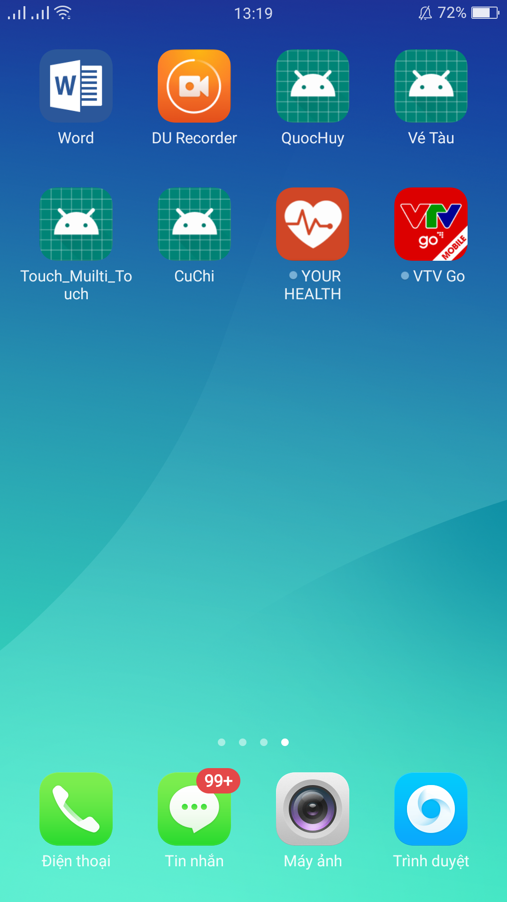
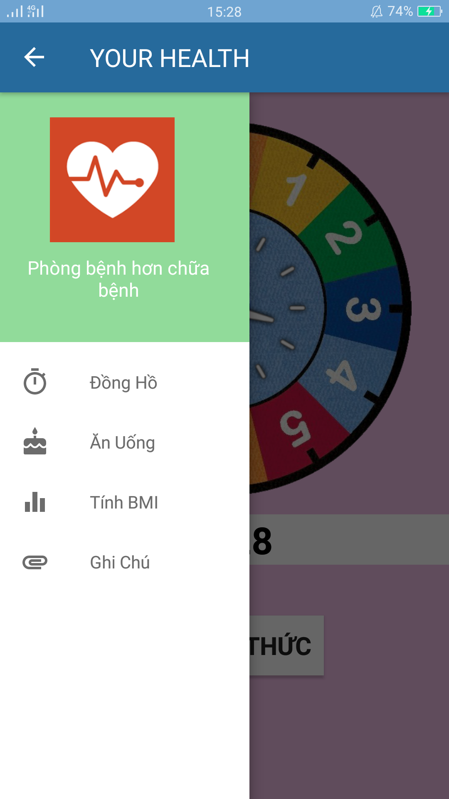
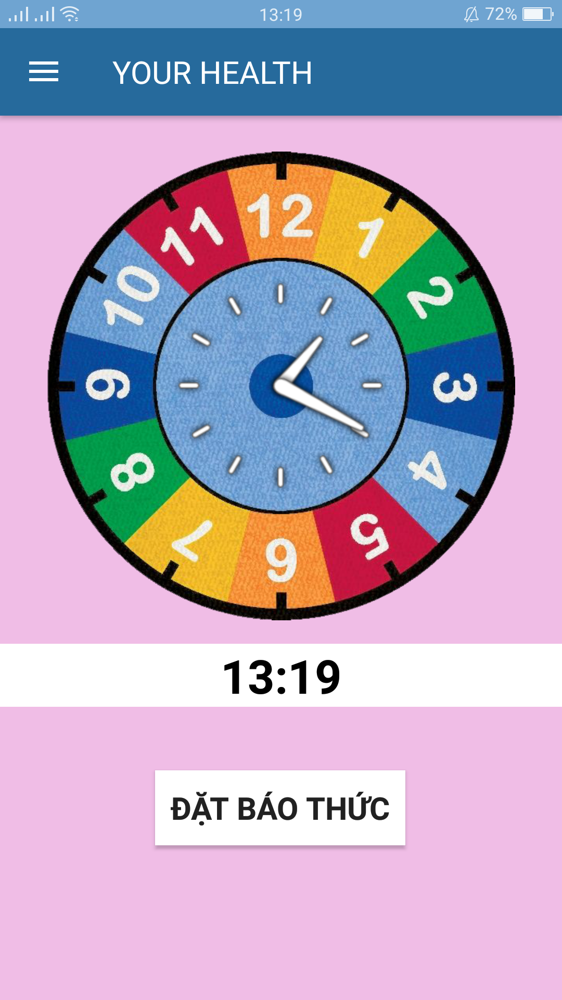
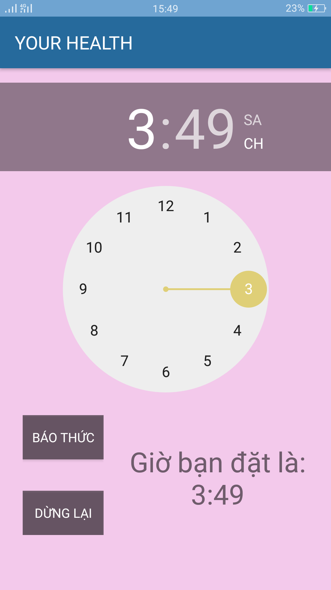
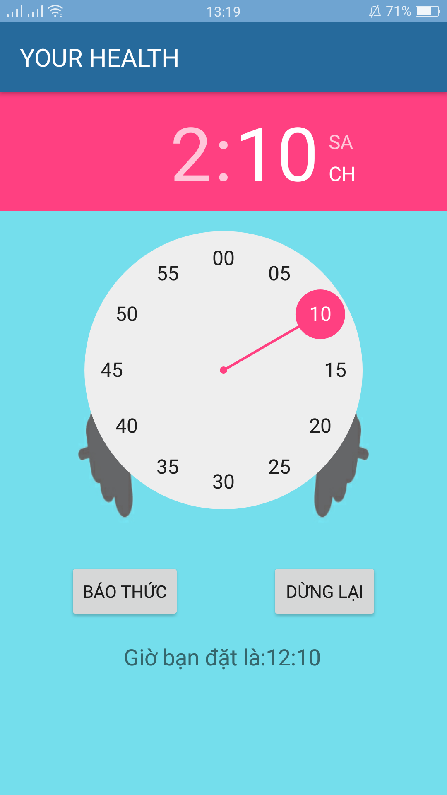
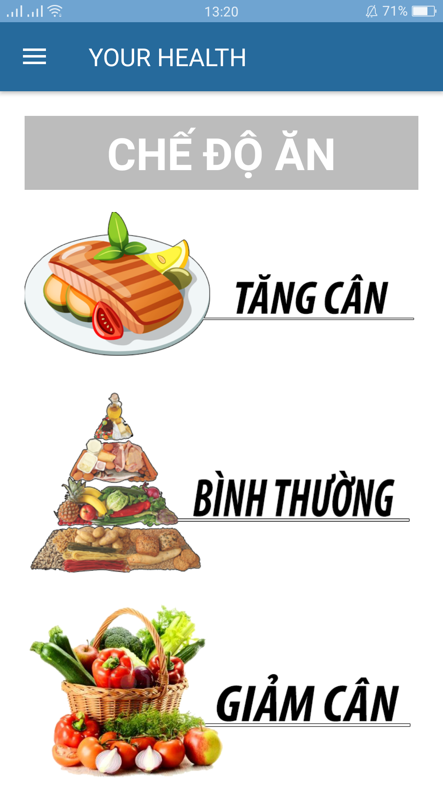
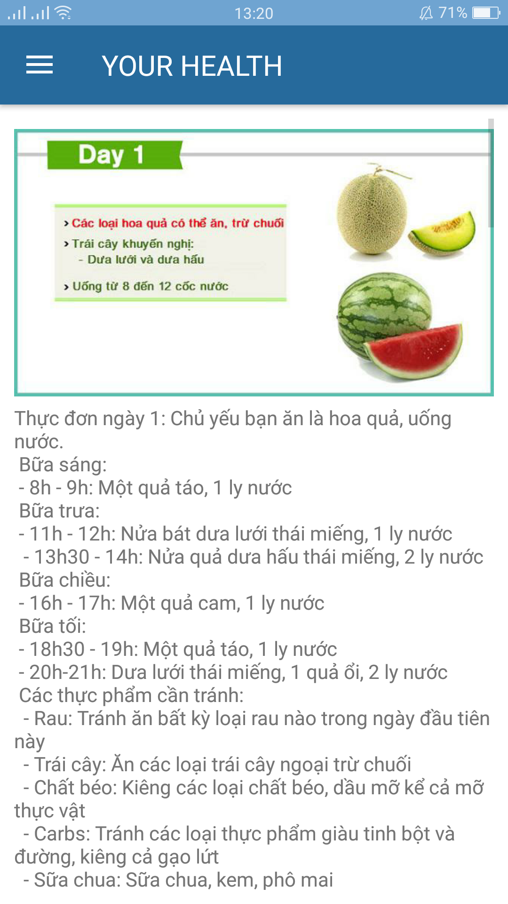
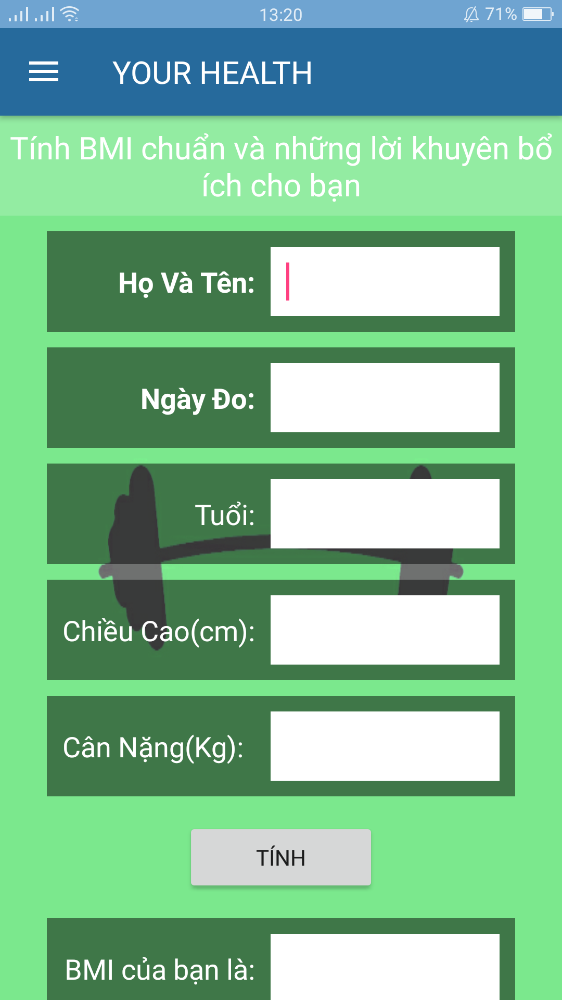
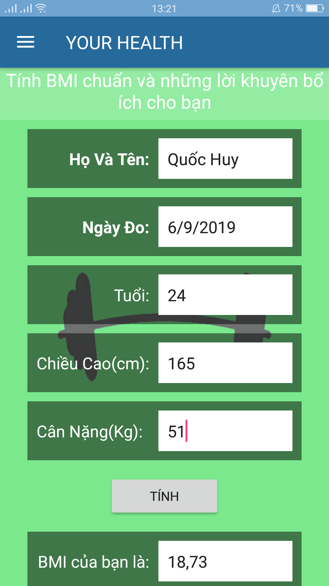
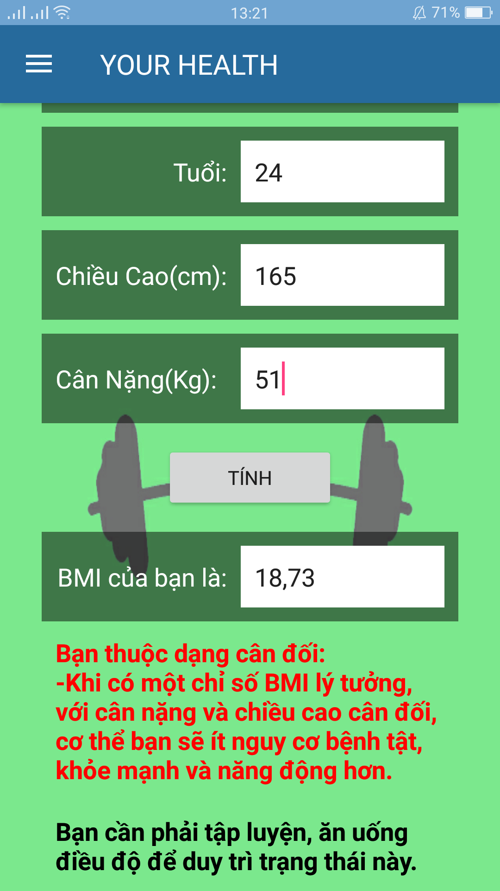

# Xin giới thiệu: Ứng dụng trên thiết bị di động Androi của chúng tôi tên YOUR HEALTH
  *Với ứng dụng "YOUR HEALTH" bạn có thể chủ động hơn trong việc chăm sóc sức khỏe của bạn YOUR HEALTH không chỉ là ứng dụng mà nó còn là người bạn thân thiết giúp bạn rèn luyện sức khỏe mỗi ngày*

# Giao diện thân thiện với người dùng #
*Thanh menu hiển thị các tính năng của ứng dụng 1 cách rõ ràng, để khi bạn cần dùng tính năng nào thì nó sẽ dẫn bạn tới tính năng mà bạn muốn*

# Cùng với các chức năng hữu ích cho bạn
1. Tính năng đồng hồ: *Khi hay quên giờ thì tính năng này sẽ giúp bạn đáng kể đó, bạn sẽ làm chủ được thời gian của mình cùng với tính năng đồng hồ cùng với đặt báo thức để nhắc bạn không quên giờ hay thúc đẩy bạn như trong việc ăn uống đúng giờ, tập thể thao.....*

  

2. Chế độ Ăn uống hợp lý: *Khi trong ngày bạn không biết bạn nên ăn những món gì hay nên ăn gì để hợp với thể trạng hiện tại của bạn, thì với ứng dụng hữu ích này sẽ có sẵn thực đơn bồ bổ cho bạn 1 cách hợp lý nhất*

 

3. Tính BMI cho bạn : *BMI với tắt của từ Body Mass Index, chỉ số khối lượng cơ thể của bạn. với tính năng này, có thể tính toán chính xác nhất về khối lượng cơ thể hiện tại của bạn để biết được bạn thuộc tuýp người mập, gầy hay bình thường, để bạn chọn chế độ ăn cho phù hợp và sắp xếp thời gian để cơ thể của bạn luôn khỏe mạnh*

  
